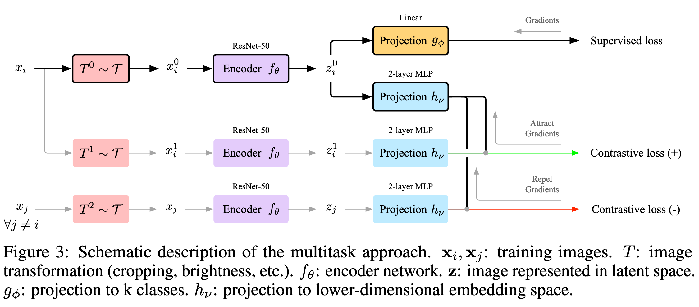

# Contrastive Training for Improved Out-of-Distribution Detection

| Date | Authors | Keywords | Paper Link | GitHub Link | Work Status |
|:----:|:-------:|:--------:|:----------:|:-----------:|:-----------:|
| 16 Jul 2020 | Winkens et al. (Google & DeepMind - Taylan Cemgil Hoca) | OOD | <https://arxiv.org/abs/2007.05566> |  | In Review |

### TL;DR

Contrastive training (which distinguish between each individual samples and incorporate prior-knowledge about identity-preserving transformations) enriches the feature representations beyond the mere needs of classification task and help detect out of distribution samples, especially near OOD samples. This strategy unlike other methods does not incorporate any additional supervision and thus can be integrated in standard setups easily.

### Highlights

- **Contrastive Training** tries to distinguish between each training sample by explicitly defining a cosine similarity loss on projection layer. Representations forced to be more rich and discriminative by applying various class-preserving image transformations (crop-resize, color distortion) and pulling representation from the same sample (positive contrastive) and pushing all distinct samples away (negative contrastive). (Figure 3, more detail: **[SimCLR](https://arxiv.org/abs/2002.05709)**)

    

    - Training is first started with contrastive loss and then fine-tuned with supervised loss
- Outliers detected by fitting Gaussian density estimators on the activations of training data on penultimate layer of encoder. On top of contrastive training, label smoothing is added to supervised loss in order to prevent network from spreading out the activations to infinity and encourage tighter clustering of activations ([ref](https://arxiv.org/abs/1906.02629)) within class.
    - Note that contrastive training encourages more disperse clustering within class.
    - OOD score is defined as the maximum of class-conditional estimators (low indicates far OOD, high indicates near OOD).
- **Confusion Log Probability**: Train N classifiers on combined dataset (i.e. both original and outlier) with combined classes and use average of predicted (expected) probabilities as class  probabilities. **CLP** defined as log of average of probability of assigning an outlier sample to original classes. High CLP indicates near OOD whereas low CLP indicates far OOD.
    - 5 ResNet-34 models used to measure visual similarity rather semantic or image space similarity. (Question: what are the differences of these similarity types?)
- AUROC results show that proposed method improves upon state of the art albeit being an unsupervised work.
    - In ablation studies, we see that "only label smoothing" setting achieves similar performance with "only contrastive training" setting. However, utilization of both significantly increases performance.
    - Even though work claims that they improve Near OOD significantly, unsupervised [previous work](https://arxiv.org/abs/1610.02136) (2016) obtains very similar Near OOD performance but significantly worse Far OOD performance. Improvement over supervised previous works are higher in the case of Near OOD.
    - Capacity of the model used (ResNet-50) larger than typical in the literature. Authors showed *Mahalanobis* approach doesn't yield better results with larger network but for other approaches there might be a network capacity mismatch in results. One particular interest is whether 2016 unsupervised baseline which uses just softmax activations can catch this work if network capacity to be increased.
    - This work clearly demonstrates unsupervised representation learning is useful for OOD detection. The work only focused on improving representations to make OOD gains. One can also think of complementary work on improving detection strategy (scoring OODness) such as this promising [flow-based work](https://arxiv.org/abs/2003.12506).

### Further Ideas

- OOD and adversarial detection is different in terms of data points considered but also similar in terms of outlier distributional challenges. Is it possible to see adversarial samples as some edge case of OOD (very *local*)? I believe there has to be a work connecting these two domains. Here are some more concrete ideas on how to utilize adversarial domain and methods used in papers together:
    - Contrastive training employs class-invariant image transformations. One of the properties we seek in adversarial attacks is also that they don't change the class of the original sample considered. Therefore, we can see adversarial attacks as such transformations and utilize them *inside* contrastive training.
        - Can this combined strategy help OOD detection?
        - Can this combined strategy help adversarial robustness?
        - Label smoothing seems to achieve impressive OOD gains in this paper. Can label smoothing help adversarial robustness? This work uses label smoothing to avoid network pushing activations to infinity. Can binary labels and many iterations on these binary labels somehow help the formation of adversarial samples?
            - Can one propose gradient-free robustness mechanism such as: Contrastive training + label smoothing + orthogonal regularization?
- Using deep residual flows which explicitly models data distribution is promising for OOD. Authors recognize [this work](https://arxiv.org/abs/2003.12506) complementary and cite [this work](https://arxiv.org/abs/2001.05419). Can contrastive modeling utilized on deep flows to improve data modeling significantly? If yes, OOD detection in the context of generative deep flows is just finding a probability threshold.

### Further Links

- [PyTorch implementation of Contrastive Learning methods and list of papers](https://github.com/HobbitLong/PyContrast)
